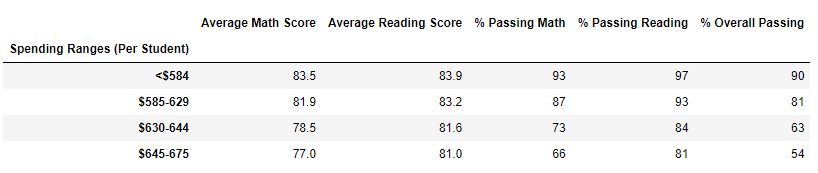

# School_District_Analysis

## Project Overview
A representative from the school board has tasked me with analyzing school data from the district, including student's math and reading scores. The school board is wanting a snapshot of the district's key metrics, as well as each school's, including: the top 5 and bottom 5 performing schools (based on the overall passing rate), the average math and reading scores in each grade level at each school, school performance based on the budget per student, school performance based on the school size, and school performance based on the type of school.

This analysis was first completed before realizing that there were alterations made to Thomas High School's ninth grade math and reading scores. Thus those scores were subsequently left out of the calculations for averages in the second analysis. Below I will analyze the results and the differences caused by leaving out the altered data.

## Results

In each category, the omission of the Thomas High School (THS) 9th grade reading and math scores resulted in the following changes:

- **District Summary:**
	- Average math score decreased 0.1 point
	- Percentage of students passing math decreased 0.2%
	- Percentage of students passing reading decreased 0.3%
	- Overall Passing percentage of students decreased 0.1%
	- DataFrame before omitting THS 9th grade scores:
  
	- DataFrame after omitting THS 9th grade scores:
  

- **School Summary:**
	- Data is the same for all schools except Thomas High School (THS)
	- THS average math score decreased 0.5 points
	- THS average reading score increased 0.1 points
	- THS percentage of students passing math decreased 0.1%
	- THS percentage of students passing reading decreased 0.3%
	- THS overall passing percentage of students decreased 0.3%
	- DataFrame before omitting THS 9th grade scores:
  
	- DataFrame after omitting THS 9th grade scores:
  

- **Highest Performing Schools:**
	- Updating the scores didn't affect the averages and percentages enough to change Thomas High School's place in the highest performing schools (2nd place), however their scores are slightly lower in all categories, except in the average reading score, where the score has increased by 0.5 points
	- DataFrame before omitting THS 9th grade scores:
  
	- DataFrame after omitting THS 9th grade scores:
  

- **Math and reading scores by grade:**
	- Data is the same for all schools and grades except for THS 9th graders, where the data has been omitted ("NaN")
	- Math DataFrame before and after omitting THS 9th grade scores (respectively):

  
  

	- Reading DataFrame before and after omitting THS 9th grade scores (respectively):

  
  

- **Scores by school spending:**
	- There are some slight changes in the numbers for the spending bin that THS is a part of ($630 to $644 per student), however the difference is so small that rounding the amounts to the tens place doesn't account for the changes
	- DataFrame before omitting THS 9th grade scores:
  
	- DataFrame after omitting THS 9th grade scores:
  

- **Scores by school size:**
	- Similarly to above, there are changes in the bin that THS is a part of (Medium: 1000 - 2000 students), however the rounding does not show the change
	- DataFrame before omitting THS 9th grade scores:
  
	- DataFrame after omitting THS 9th grade scores:
  

- **Scores by school type:**
	- Again, there are changes in the category that THS is a part of (Charter Schools), however the rounding does not show the change
	- DataFrame before omitting THS 9th grade scores:
  
	- DataFrame after omitting THS 9th grade scores:
  

## Summary

The following are the four most significant changes in the data, caused by replacing the Thomas High School (THS) 9th grade math and reading scores with NaNs.

1. THS averages and percentages changed (most evident in the school summary, where we are just can see THS's scores isolated). Since the 9th grade scores were removed, the 10th, 11th, and 12th grade scores pull a little more weight in the overall averages and percentages for the school. For the most part, the school's scores were pulled down slightly by omitting the altered 9th grade scores.

2. While THS's overall averages and percentages were affected by replacing the 9th grade scores with NaNs, this change was not significant enough for THS to lose its position as 2nd highest ranking school.

3. The changes to scores by school spending, school size, and school type were so small that they were essentially negligible due to rounding. If we were to round to the hundredths place, we would be able to see these changes in the resulting DataFrames.

4. Replacing THS's 9th grade scores did end up lowering the entire district's averages and percentages by a small percentage.
